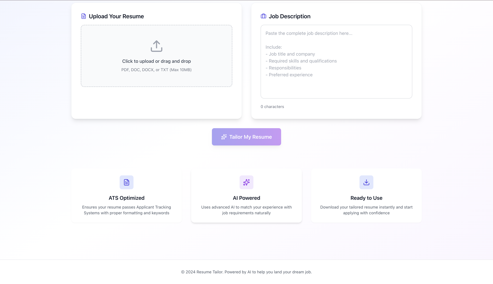

# 📄 Resume Tailoring Web Application (AI-Powered)

> An AI-powered full-stack web application that customizes resumes based on job descriptions using modern frontend tooling and a Node.js + OpenAI backend.

🌐 **Live Demo:**  
👉 https://resume-tailor-frontend-dun.vercel.app/

---

## 🚀 Project Overview

The **Resume Tailoring Web Application** helps job seekers transform generic resumes into **job-specific, optimized resumes**.

Users can:
- Upload resumes (PDF / DOCX)
- Paste job descriptions
- Get AI-tailored resume content instantly

This project follows a **modern full-stack architecture** with a fast Vite + React frontend and a robust Express backend integrated with OpenAI.

---

## 🧱 Tech Stack

### 🎨 Frontend (Client)

Built using modern React tooling.

**Core Technologies**
- **React 19** – Interactive UI development
- **Vite (Rolldown)** – Ultra-fast build tool & dev server
- **Axios** – API communication with backend
- **Tailwind CSS** – Utility-first CSS framework
- **Lucide / Lucide-React** – Modern icon library

**Developer Tooling**
- ESLint (React Hooks rules)
- PostCSS + Autoprefixer
- Hot Module Reloading (HMR)

**Frontend Responsibilities**
- Resume & job description input
- File uploads
- API calls to backend
- Displaying tailored resume output

---

### 🧠 Backend (Server)

Node.js + Express backend with AI integration.

**Core Technologies**
- **Node.js (ES Modules)** – Server runtime
- **Express.js** – REST API framework
- **OpenAI SDK** – AI-powered resume tailoring
- **Multer** – File upload handling
- **Mammoth** – DOCX text extraction
- **PDFReader** – PDF resume parsing
- **CORS** – Cross-origin request handling
- **dotenv** – Environment variable management

**Backend Responsibilities**
- Accept resume uploads (PDF / DOCX)
- Extract resume text
- Process job descriptions
- Send structured prompts to OpenAI
- Return tailored resume content

---

## 🧠 How the System Works

```text
User
 ↓
Frontend (React + Vite)
 ↓
Backend API (Express)
 ↓
Resume Parsing (PDF / DOCX)
 ↓
OpenAI Resume Tailoring
 ↓
Tailored Resume Output
 ↓
Frontend Display
```

# 📁 Project Structure
```
Resume-Tailoring-webapplication/
│
├── client/                  # Frontend (React + Vite)
│   ├── src/
│   ├── public/
│   └── package.json
│
├── server/                  # Backend (Node + Express)
│   ├── index.js
│   └── package.json
│
├── screenshots/             # README screenshots
└── README.md
```
# 📸 Screenshots


# 🧪 Local Development Setup
git clone https://github.com/sketchy-programmer/Resume-Tailoring-webapplication.git
cd Resume-Tailoring-webapplication

# 2️⃣ Frontend Setup
cd client
npm install
npm run dev

# 3️⃣ Backend Setup
cd server
npm install
npm run dev

## Create a .env file in the server folder:
OPENAI_API_KEY=your_openai_api_key_here

# 🌐 Deployment
✅ Frontend


Hosted on Vercel


Continuous deployment from GitHub


# 🔗 Live URL:
https://resume-tailor-frontend-dun.vercel.app/
(Backend can be deployed using Render, Railway, or Fly.io.)

# ✨ Key Features


AI-powered resume tailoring


PDF & DOCX resume support


Clean and responsive UI


Fast Vite build system


Modular backend architecture


# 🔮 Future Enhancements


ATS keyword matching & scoring


Resume download as PDF


Multiple resume versions


User authentication


Job description history


# 🤝 Contributing
Contributions are welcome!


Fork the repository


Create a feature branch


Commit your changes


Open a pull request


# 📜 License
This project is licensed under the ISC License.

# ⭐ Support the Project
If you find this project useful, please ⭐ star the repository on GitHub.

---

### 🔥 NEXT OPTIONAL UPGRADES (I can do these for you)
- Add **badges** (React, Vite, OpenAI, Vercel)
- Create a **portfolio-optimized README**
- Write a **LinkedIn case study**
- Add **GIF demo instead of screenshots**

Just tell me what you want next 👌
